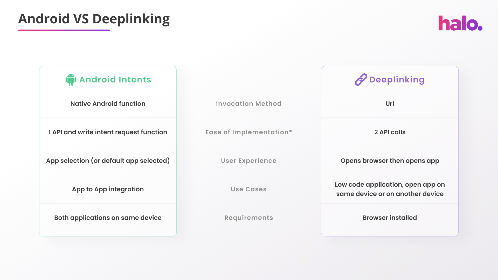

#### App to App Integration Methods

The Halo Dot Link application currently provides different mechanisms to integrate our payments solution depending on your use case. The different methods are:

1. Android Intents Mechanism
2. Deeplinking Mechanism

