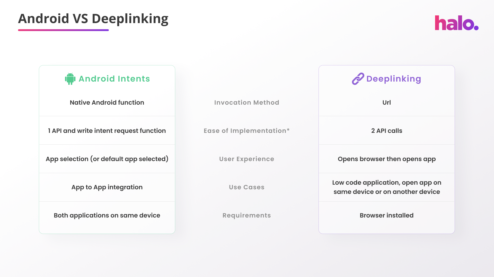

### App to App Integration Methods

With Halo Dot the exact same technology can be used for different use cases. However, the integration is slightly different to allow us to distinguish the use cases. The use cases and their specific integration guides are: 

1. Android Intents Mechanism
2. Deeplinking Mechanism

